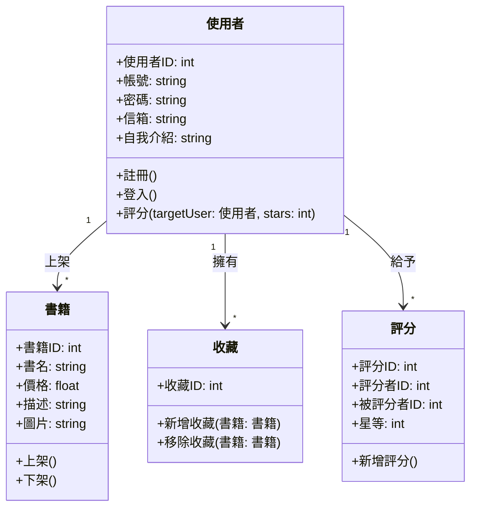
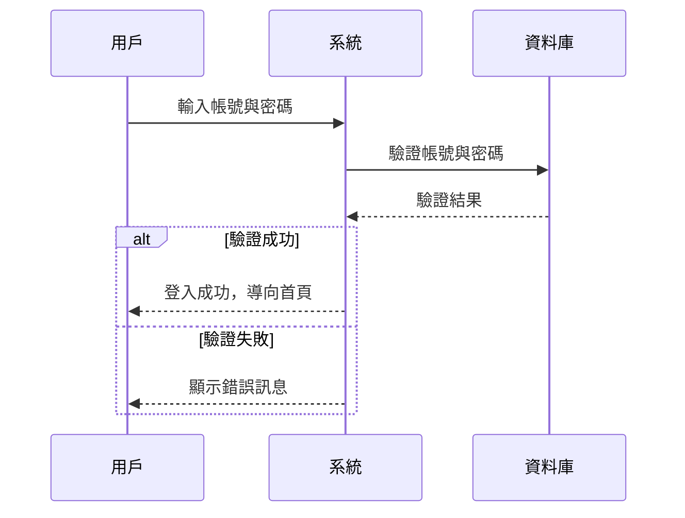
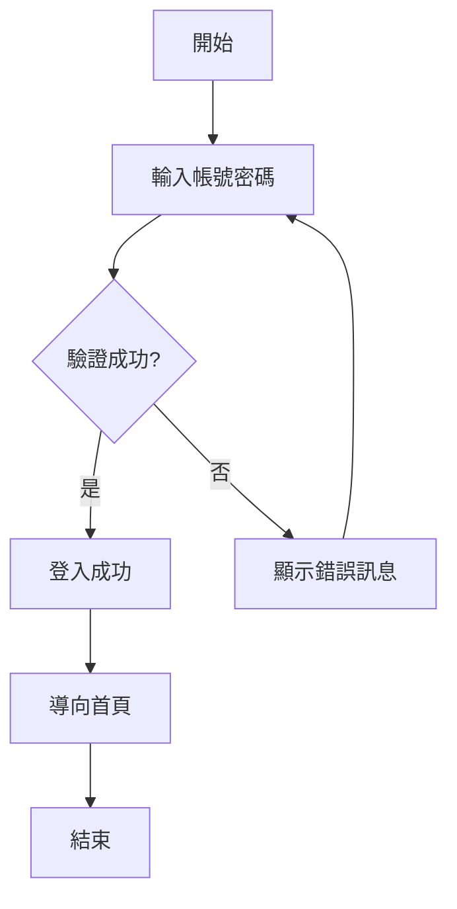
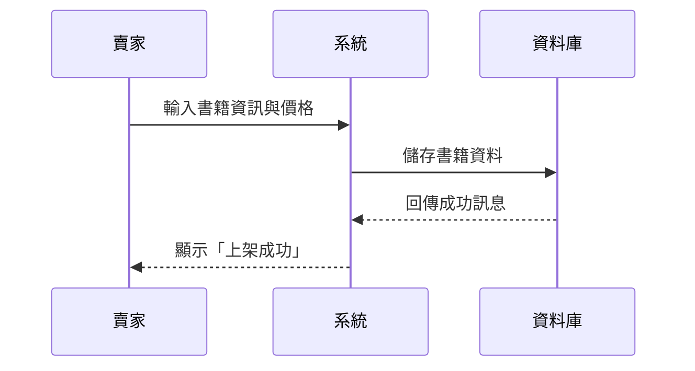
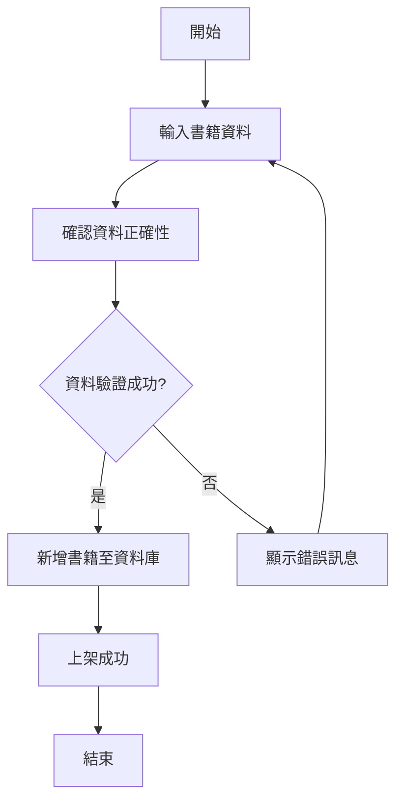
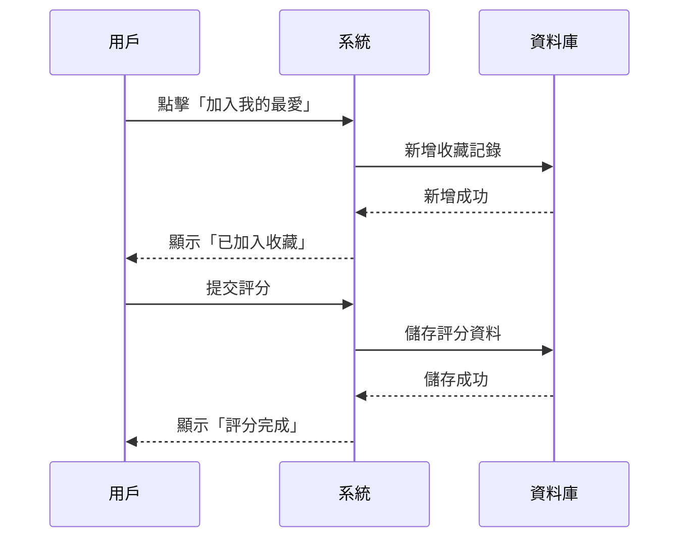
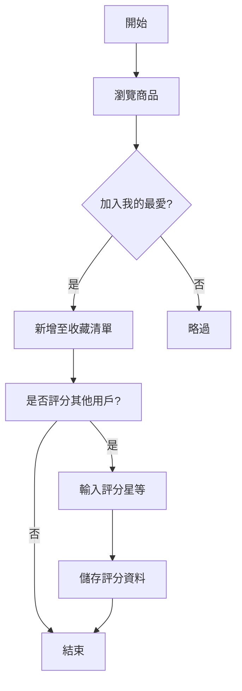

# 二手書交易平台 UML 文件

## 一、類別圖（Class Diagram）

----------------------------------
## 使用案例一：使用者登入

----------------------------------
## 使用案例一

----------------------------------
## 使用案例二

----------------------------------
## 使用案例二

----------------------------------
## 使用案例三

----------------------------------
## 使用案例三

----------------------------------
